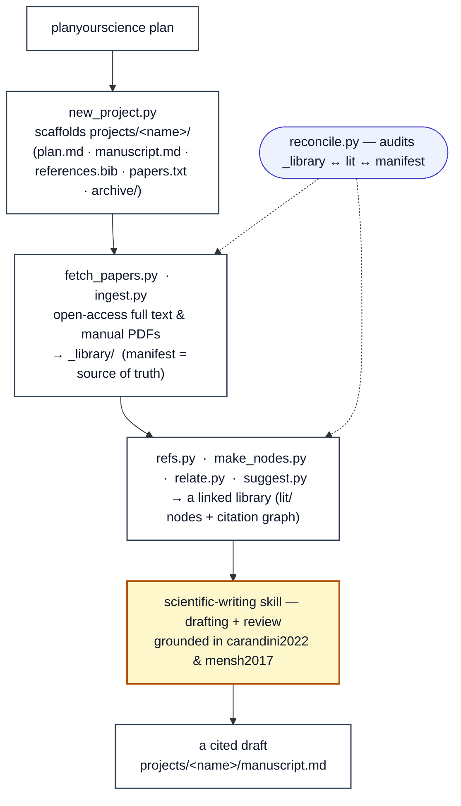

# neuresearch — a paper-writing system

**neuresearch turns a plan into a finished, cited paper.** You start with a
[planyourscience](https://planyourscience.com)-shaped plan; the system finds and
fetches the supporting literature, builds a linked library (literature nodes + a
citation network), helps you draft and review the manuscript with a
methodology-grounded writing skill, and leaves you with a cited draft.

It is two halves:

- **neuresearch/** (this repo) — the *builder*: the acquisition/organization layer
  (`src/`) and the writing know-how (`skills/`).
- **neubrain/** (the vault) — the *product*: one Obsidian vault where papers,
  literature nodes, concepts, projects, and manuscripts share a single
  `[[wikilink]]` graph. **neubrain is what neuresearch builds.**

The core of the system is the **writing workflow** — the `scientific-writing`
skill, grounded in Carandini (*Some Tips for Writing Science*) and Mensh & Kording
(*Ten simple rules for structuring papers*). The `src/` scripts are the supporting
layer that gets the right literature in front of that workflow.

## The pipeline



Health checks run throughout: `reconcile.py` audits `_library/ ↔ lit/ ↔ manifest`,
and the Obsidian **Dataview** dashboards (`neubrain/dashboard.md`,
`projects/<name>/dashboard.md`) give a live library view.

For the step-by-step recipe book, see **`neubrain/USAGE.md`**.

## `src/` — the supporting acquisition / organization layer

| script | role |
|---|---|
| `new_project.py` | scaffold a new project's front door (plan, papers list, manuscript stub) |
| `fetch_papers.py` | resolve identifiers → open-access full text (Europe PMC JATS, Unpaywall PDF) into `_library/` |
| `ingest.py` | absorb a manually-acquired PDF as a full library citizen (identify → metadata → manifest) |
| `refs.py` | backfill each paper's `cited_dois` from Crossref (GROBID optional), no conversion |
| `make_nodes.py` | generate `lit/` nodes (two phases: `propose`, then `wire` concepts) |
| `relate.py` | draw the `## Related` layer from shared/citing references |
| `suggest.py` | propose new candidate papers (OpenAlex citation graph + plan keywords) |
| `reconcile.py` | read-only integrity check of the paper subsystem |
| `export_project.py` | materialise a project's papers into a folder on demand (`exports/`) |
| `sync_skills.py` | deploy `skills/` → `~/.claude/skills/` (real copies; `--check` audits drift) |
| `log_writer.py` | append-only Markdown fetch log (`FetchLog`) |

Scope of acquisition is open-access only (Europe PMC + Unpaywall; OpenAlex/Crossref
for metadata). Papers live **once** in `_library/`; a project "has" a paper via the
manifest's `projects` field plus a `lit/` node, never a per-project copy.

## `skills/` — the core writing know-how

`skills/scientific-writing/SKILL.md` is the **source of truth** for the writing
workflow. Edit it here, then deploy it to where Claude Code loads skills:

```
python src/sync_skills.py            # copy skills/ → ~/.claude/skills/ (NFS-safe copies)
python src/sync_skills.py --check    # read-only: report drift, change nothing
```

(Equivalent one-liner from the repo root: `cp -r skills/* ~/.claude/skills/`.)

## Setup

Runs in a dedicated `neuresearch` conda env:

```
conda env create -f environment.yml   # first time
conda activate neuresearch            # each session
```

If you don't activate it, prefix commands with `conda run -n neuresearch`, e.g.:

```
conda run -n neuresearch python3 src/fetch_papers.py ...
```

Tools take `--vault /path/to/neubrain`; the vault is the product, this repo is the
builder.
